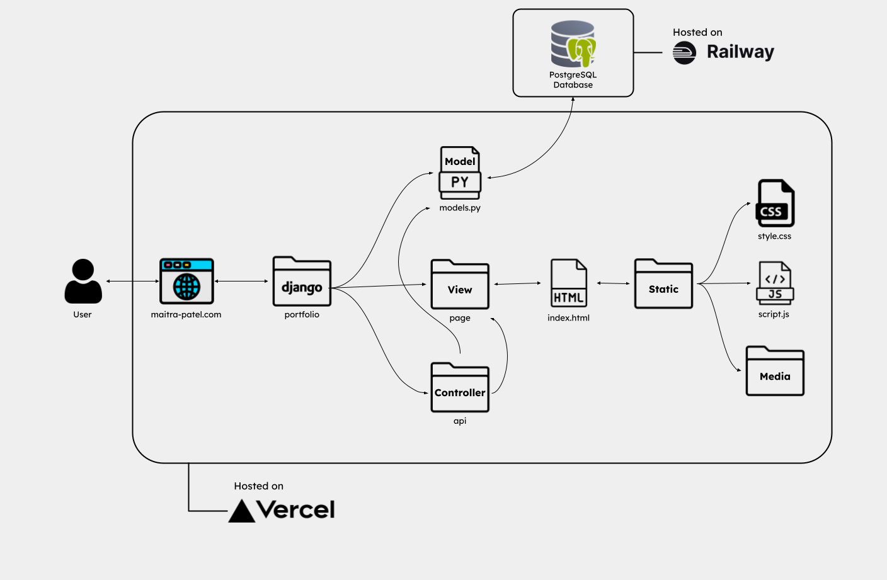

# 💻 Portfolio
[Check it out!](https://www.maitra-patel.com/)
### :thinking: How I made it

 
 
 

Hosting the Django app on [Vercel](https://vercel.com). 
Hosting the PostgreSQL server on [Railway](https://railway.app/).

  
Tech Diagram

  

